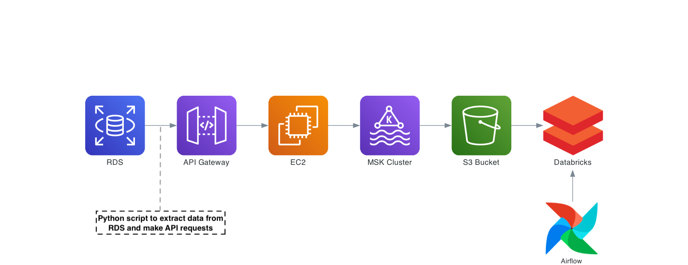
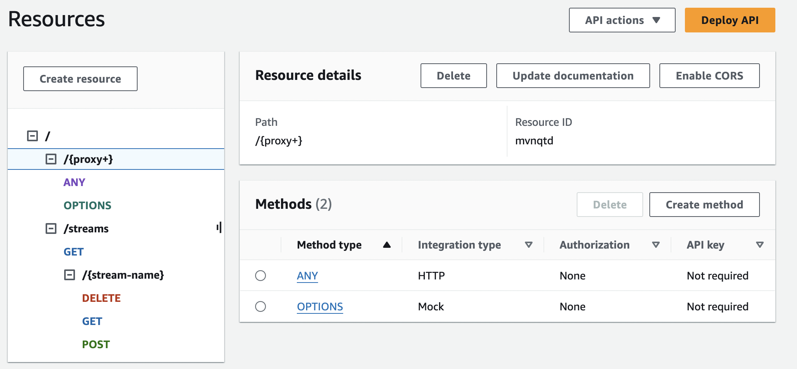
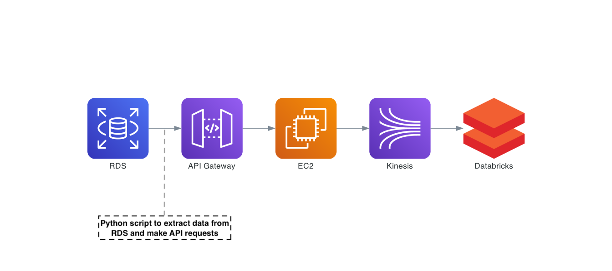

# Pinterest Data Pipeline Project

## Outline
This is a project which involved creating a system for extracting, storing, transforming and analysing emulated Pinterest post data through the creation of two data pipelines, with one for **batch processing** and one for **real-time processing** of streaming data. The aim of this project was to understand the process of building a fully functional data pipeline and improve my knowledge of various key data engineering tools and services, namely:
- **Python** - For running a Pinterest posting emulation via AWS RDS queries and interacting with Kafka and AWS Kinesis through API requests
- **Kafka (Using Amazon MSK)** - For ingesting the raw Pinterest data and writing it to topics in an S3 bucket for batch processing in Databricks
- **Amazon EC2** - For setting up a Kafka client machine
- **Apache Airflow (Using Amazon MWAA)** - For scheduling batch processing tasks
- **Amazon Kinesis** - For ingesting the raw Pinterest data as data streams for real-time processing in Databricks
- **Amazon API Gateway** - For deploying a REST API to interact with MSK and Kinesis
- **Databricks** - For data cleaning and transformation (batch and real-time processing) and SQL queries for identifying key metrics

## Installation and Initialisation
The code for this project was created and tested using Python 3.12.0 with the *json*, *random*, *sqlalchemy* and *time* libraries. Running the **user_posting_emulation.py** script effectively initiates the data pipeline for batch processing via Kafka while the **user_posting_emulation_streaming.py** script can be used for the streaming data pipeline via Kinesis. The data can then be transformed using Dabatabricks with the relevant notebooks that are included in this project directory. Please note that detailed instructions for setting up the relevant AWS cloud infrastructure mentioned in the outline are outwith the scope of this readme, but the general setup is explained in the following section. 

## Project Structure
### Batch Processing Pipeline

The image above showes the overall stucture of the pipeline for batch processing. Breaking it down into four main steps: 
  
**1. Pipeline intitiated from Python Script**  
The **user_posting_emulation.py** file is run which continually extracts data from random rows in the RDS database. The RDS database contains three tables containing data relevant to a post on pinterest (pinterest post data, geographical data and user data). This data is reformatted and sent as a payload of a HTTP POST request to an Amazon API Gateway Endpoint.

**2. Amazon API Gateway communicates with EC2 Machine (Kafka Client) and MSK Cluster**

An API has been set up on Amazon API Gateway, which communicates with the EC2 Machine via HTTP proxy integration. The EC2 machine has already been set up as a Kafka Client machine and has the Confluent REST Proxy service installed which enables the consumption of messages in the aforementioned topics in the MSK cluster when HTTP POST requests are made to the API. As shown above, the API has a proxy resource set up that is used for writing messages to each of these topics.  

**3. MSK writes messages to S3 bucket**
MSK has been set up with the Confluent.io Amazon S3 Connector in order to automatically write the messages in each of these topics to an S3 bucket as soon as they are received.

**4. Scheduled batch processing carried out using Databricks and MWAA**
Using a Databricks notebook, the S3 bucket is mounted to the Databricks File System, which enables the series of json messages to be transformed into three dataframes, one for each of the topics. These dataframes are then cleaned and transformed (cleaning erroneous values and concatenating, renaming, reordering columns) and queried to obtain a range of insights on the data.

Using Apache Airflow (through Amazon MWAA) a DAG is defined that runs the Databricks notebook daily so that the fresh messages from the S3 bucket can be processed. 

### Streaming Pipeline

The image above showes the overall stucture of the pipeline for processing streaming data. It is largely similar to the batch processing pipeline, with the key difference being that the API is used to communicate with Amazon Kinesis with AWS service integration. Databricks is then able to consume messages and carry out the same data transformation tasks in real-time. 

## File structure
```
├── 0ad8a60ac12f_dag.py
├── user_posting_emulation.py
├── user_posting_emulation_streaming.py
├── sql_queries.sql
├── databricks_notebooks
│   ├── batch_processing_notebook.ipynb
│   └── streaming_processing_notebook.ipynb
├── sample_dataframes
|   ├── df_geo.csv
|   ├── df_pin.csv
|   └── df_user.csv
└── images
    ├── api.png
    ├── batch.png
    └── stream.png
```
### Python Files (.py)
- *0ad8a60ac12f_dag.py* - Script for DAG which runs databricks notebook daily
- *user_posting_emulation.py* - Code for emulating user posting data, which is sent to Kafka via API for batch processing pipeline
- *user_posting_emulation_streaming.py* - Code for emulating user posting data and sending to Kinesis streams via API for streaming pipeline

### sql_queries.sql
This file contains all of the SQL queries performed on the cleaned dataframes, and what insights they are trying to uncover

### Databricks Notebooks Folder (.ipynb)
This contains databricks notebooks used for processing the raw pinterest data in real time and daily batches
  
### Sample Dataframes Folder (.csv)
This contains sample dataframes that have been converted to csv and downloaded before batch databricks, to give an understanding of the data used in this project (and so indirectly the relevant transformations and SQL queries)

### Images folder
This contains the images used in this readme

## License information
This is free and unencumbered software released into the public domain.


